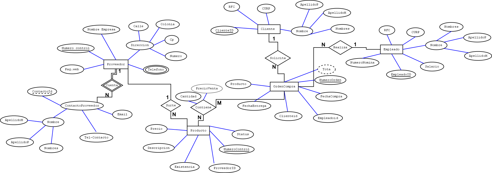
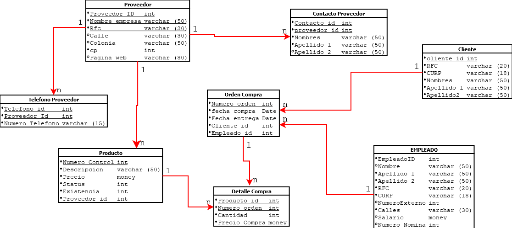

# Requerimientos
Una empresa encargada de las ventas de diferentes productos desea crear una base de datos que controles los proveedores, clientes, empleados, categorías de producto y órdenes de compra. Para los proveedores se necesita almacenar un numero de control, nombre de la empresa, dirección (numero, calle, colonia, estado), cp,teléfono, página web, teléfono de contacto o contactos del proveedor, nombre del contacto, email del contacto. Para los empleados se desea almacenar un numero de nómina, nombre completo del empleado, rfc, curp, salario (El salario máximo es de 65000), para las ordenes de compra se necesita almacenar la fecha de creación de la orden, el empleado que la realizo, al cliente que se le vende, la fecha de entrega y los diferentes productos que contiene. El producto debe almacenar un numero de control y una descripción única, status, existencia y un precio. La categoría debe tener un identificador y nombre único de categoría. La compra siempre debe tener un precio de venta que se obtiene del precio unitario del producto y una cantidad vendida.
# Diagrama E-R


# Diagrama Relacional


# Creacion de BD con lenguaje SQL-LDD
```sql
CREATE TABLE CLIENTEE(
Cliente_ID int not null identity(1,1),
rfc varchar(20) not null,
curp varchar(18)not null,
nombres varchar(50)not null,s
apellido_1 varchar(50)not null,
apellido_2 varchar(50)not null,
constraint pk_cliente
primary key (Cliente_ID),
constraint unico_rfc
unique(rfc),
constraint unico_curp
unique(curp)
);

CREATE TABLE ContactoProveedor(
Contacto_ID int not null identity(1,1),
Proveedor_ID int not null,
nombres varchar(50)not null,
apellido_1 varchar(50)not null,
apellido_2 varchar(50)not null,
constraint pk_contacto
primary key (Contacto_ID),
);

alter TABLE ContactoProveedor
add constraint fk_Proveedor_ContactoP
foreign key (Proveedor_ID)
REFERENCES Proveedor (Proveedor_ID)

CREATE TABLE Proveedor(
Proveedor_ID int not null identity(1,1),
nombreEmpresa varchar(50)not null,
rfc varchar(20) not null,
calle varchar(30) not null,
colonia varchar(30) not null,
cp varchar(10)not null,
paginaWeb varchar(80),
constraint pk_proveedor
primary key (Proveedor_ID),
constraint unico_empresa
unique(nombreEmpresa),
constraint unico_rfc2
unique(rfc),
);

CREATE TABLE EMPLEADO(
Empleado_ID int not null identity(1,1),
nombres varchar(50)not null,
apellido_1 varchar(50)not null,
apellido_2 varchar(50)not null,
rfc varchar(20) not null,
curp varchar(18)not null,
numExterno int,
calle varchar(50),
salario money not null,
numNomina int not null,
constraint pk_empleado
primary key (Empleado_ID),
constraint unico_rfc_Empleado
unique (rfc),
constraint unico_Curp_Empleado
unique (curp),
constraint chk_salario
check (salario>=0.0 and salario<=100000),
--Donde el (salario BETWEN entre 0.0 and 100000)--
constraint unico_nomina_empleado
unique (numNomina)
);

CREATE TABLE TelefonoProveedor(
Telefono_ID int not null identity(1,1),
NoTelefono varchar(30)not null,
Proveedor_ID int not null,
constraint pk_telefono_proveedor
primary key (Telefono_ID,Proveedor_ID),
constraint fk_telProveedor_Proveedor
foreign key (Proveedor_ID)
REFERENCES Proveedor (Proveedor_ID)
on delete cascade
on update cascade
);

CREATE TABLE PRODUCTO(
Num_Control int not null identity(1,1),
descripcion varchar(50)not null,
precio money not null,
[status] int not null,
existencia int not null,
Proveedor_ID int not null,
constraint pk_producto_NumControl
primary key (Num_Control),
constraint unico_descripcion
unique(descripcion),
constraint chk_precio
--precio>=1 y precio<=20000--
check (precio between 1 and 20000),
constraint chk_status
--status en (0,1)--
check([status]=1 or [status]=0),
constraint chk_existencia
check(existencia>0),
constraint fk_Producto_Proveedor
foreign key (Proveedor_ID)
REFERENCES Proveedor (Proveedor_ID)
);
CREATE TABLE ORDEN_COMPRA(
num_Orden int not null identity (1,1),
fecha_orden date not null, 
fecha_entrega date not null,
Cliente_ID int not null,
Empleado_ID int not null,
constraint pk_OrdenCompra
primary key(num_Orden),
constraint fk_OrdenCompra_Cliente
foreign key (Cliente_ID)
references CLIENTEE (Cliente_ID),
constraint fk_OrdenComora_Empleado
foreign key (Empleado_ID)
references EMPLEADO(Empleado_ID)
);

CREATE TABLE Detalle_Compra(
Producto_ID int not null,
num_Orden int not null,
cantidad int not null,
precioCompra money not null
constraint pk_DetalleCompra
primary key(Producto_ID, num_Orden),
constraint fk_OrdenCompra_Producto
foreign key (Producto_ID)
References PRODUCTO(Num_Control),
constraint fk_OrdenCompra_Compra
foreign key (num_Orden)
references ORDEN_COMPRA (num_Orden)
);

CREATE TABLE CLIENTEE(
Cliente_ID int not null identity(1,1),
rfc varchar(20) not null,
curp varchar(18)not null,
nombres varchar(50)not null,
apellido_1 varchar(50)not null,
apellido_2 varchar(50)not null,
constraint pk_cliente
primary key (Cliente_ID),
constraint unico_rfc
unique(rfc),
constraint unico_curp
unique(curp)
);

CREATE TABLE ContactoProveedor(
Contacto_ID int not null identity(1,1),
Proveedor_ID int not null,
nombres varchar(50)not null,
apellido_1 varchar(50)not null,
apellido_2 varchar(50)not null,
constraint pk_contacto
primary key (Contacto_ID),
);

alter TABLE ContactoProveedor
add constraint fk_Proveedor_ContactoP
foreign key (Proveedor_ID)
REFERENCES Proveedor (Proveedor_ID)

CREATE TABLE Proveedor(
Proveedor_ID int not null identity(1,1),
nombreEmpresa varchar(50)not null,
rfc varchar(20) not null,
calle varchar(30) not null,
colonia varchar(30) not null,
cp varchar(10)not null,
paginaWeb varchar(80),
constraint pk_proveedor
primary key (Proveedor_ID),
constraint unico_empresa
unique(nombreEmpresa),
constraint unico_rfc2
unique(rfc),
);

CREATE TABLE EMPLEADO(
Empleado_ID int not null identity(1,1),
nombres varchar(50)not null,
apellido_1 varchar(50)not null,
apellido_2 varchar(50)not null,
rfc varchar(20) not null,
curp varchar(18)not null,
numExterno int,
calle varchar(50),
salario money not null,
numNomina int not null,
constraint pk_empleado
primary key (Empleado_ID),
constraint unico_rfc_Empleado
unique (rfc),
constraint unico_Curp_Empleado
unique (curp),
constraint chk_salario
check (salario>=0.0 and salario<=100000),
--Donde el (salario BETWEN entre 0.0 and 100000)--
constraint unico_nomina_empleado
unique (numNomina)
);

CREATE TABLE TelefonoProveedor(
Telefono_ID int not null identity(1,1),
NoTelefono varchar(30)not null,
Proveedor_ID int not null,
constraint pk_telefono_proveedor
primary key (Telefono_ID,Proveedor_ID),
constraint fk_telProveedor_Proveedor
foreign key (Proveedor_ID)
REFERENCES Proveedor (Proveedor_ID)
on delete cascade
on update cascade
);

CREATE TABLE PRODUCTO(
Num_Control int not null identity(1,1),
descripcion varchar(50)not null,
precio money not null,
[status] int not null,
existencia int not null,
Proveedor_ID int not null,
constraint pk_producto_NumControl
primary key (Num_Control),
constraint unico_descripcion
unique(descripcion),
constraint chk_precio
--precio>=1 y precio<=20000--
check (precio between 1 and 20000),
constraint chk_status
--status en (0,1)--
check([status]=1 or [status]=0),
constraint chk_existencia
check(existencia>0),
constraint fk_Producto_Proveedor
foreign key (Proveedor_ID)
REFERENCES Proveedor (Proveedor_ID)
);
CREATE TABLE ORDEN_COMPRA(
num_Orden int not null identity (1,1),
fecha_orden date not null, 
fecha_entrega date not null,
Cliente_ID int not null,
Empleado_ID int not null,
constraint pk_OrdenCompra
primary key(num_Orden),
constraint fk_OrdenCompra_Cliente
foreign key (Cliente_ID)
references CLIENTEE (Cliente_ID),
constraint fk_OrdenComora_Empleado
foreign key (Empleado_ID)
references EMPLEADO(Empleado_ID)
);

CREATE TABLE Detalle_Compra(
Producto_ID int not null,
num_Orden int not null,
cantidad int not null,
precioCompra money not null
constraint pk_DetalleCompra
primary key(Producto_ID, num_Orden),
constraint fk_OrdenCompra_Producto
foreign key (Producto_ID)
References PRODUCTO(Num_Control),
constraint fk_OrdenCompra_Compra
foreign key (num_Orden)
references ORDEN_COMPRA (num_Orden)
);

# Llenar base de datos con lenguaje_SQL-lMD
use [bdventas]

select * from [Northwind].dbo.Customers
go
select * from cliente;
go
--Inaerta varios clientes en una instrucci�n--
insert into cliente (RFC,curp,nombres,Apellido1,Apellido2)
values('hdsjisdjkd','NKJE628367289','Alfreds Futterkiste','jsjsjsjjsjf','Futterkiste')
insert into cliente (RFC,curp,nombres,Apellido1,Apellido2)
values
('hjsskaksg','KIJU627286822','Maria Magdalena','njsjjqja','Magdalena'),
('bdwucbowe','AEiG345732456','Santigao jonedon','jwksnmje','Narces'),
('njdsksjsj','TVDH382382999','Degdkji Jnixouns','osajojend','Naindd'),
('jnohjswnq','EDGH529485914','Martin Yondwjr','jdoiwjdeoi','Marctes');
go
insert into empleado2()
--ELIMAN LOS DATOS DE LA TABLA CLIENTE
delete cliente 
select * from cliente 
--comando para reiniciar en identity de una tabla--
DBCC CHECKIDENT (cliente, RESED, 0)
--as es= xxxx--
--Crea una tabla apartir de una aconsulta--
select top 0  EmployeeID as 'empleadoid',
LastName as 'Apellido' , 
FirstName as 'Primernombre' , 
BirthDate as 'FechaNacimiento',
HireDate as 'FechaContrataci�n', 
[address] as 'Direcci�n',
city as 'City',
region as 'Region',
PostalCode as 'CodigoPostal',
country as 'Pais'
into empleado2
from Northwind.dbo.Employees
select * from 
go
--drop=borrar la tabla empleado--
drop table empleado2
-- iNSERTYAR DATOS APARTIR DE UNA CONSULTA--
select * from empleado2
go
-- ALTERA UN CONSTRAINT DE pPRIMARY KEY EN UNA TABLA --
--alter= crear objeto--
alter table empleado2
add constraint pk_empleado2
primary key (empleadoid)
go

--top ordenar datos --
select top 5 * from Northwind.dbo.[Order Details]
order by OrderID desc
select * from empleado2
go
--Insertar datos apartir de una consulta--

select * from empleado2 (empleadoid,Apellido,Primernombre,FechaNacimiento,FechaContrataci�n,Direcci�n,City,Region,CodigoPostal,Pais)
select EmployeeID as 'empleadoid',
LastName as 'Apellido' , 
FirstName as 'Primernombre' , 
BirthDate as 'FechaNacimiento',
HireDate as 'FechaContrataci�n', 
[address] as 'Direcci�n',
city as 'City',
region as 'Region',
PostalCode as 'CodigoPostal',
country as 'Pais'
from Northwind.dbo.Employees
go